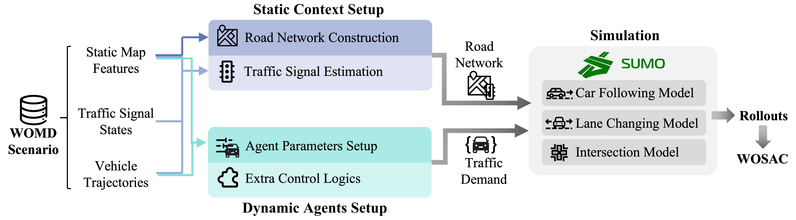

# This is the title of the paper
[Xintao Yan](), Erdao Liang, Henry X. Liu
### [Paper]() | [Project Page]()


## About



If you find this project useful, please consider citing the following paper:

```
TBD
```

## Environment Setup

1. Clone the repository, and create a conda environment by running the following code:
    ```
    conda create --name womd_tls python=3.9
    conda activate suom_benchmark
    pip install -r requirements.txt
    ```

2. Install the [Waymo Open Motion Dataset](https://github.com/waymo-research/waymo-open-dataset) SDK manually from the .whl file, as installing it via pip is not supported in some systems.
    ```
    wget https://files.pythonhosted.org/packages/14/99/7d36e6fd9ea4d676d1187c1698f6d837d151ea04fc3172c5c6e9dfa2806d/waymo_open_dataset_tf_2_12_0-1.6.4-py3-none-manylinux_2_24_x86_64.manylinux_2_28_x86_64.whl
    pip install waymo_open_dataset_tf_2_12_0-1.6.4-py3-none-manylinux_2_24_x86_64.manylinux_2_28_x86_64.whl
    rm waymo_open_dataset_tf_2_12_0-1.6.4-py3-none-manylinux_2_24_x86_64.manylinux_2_28_x86_64.whl
    ```

3. Download Waymo Open Motion Dataset from the [official website](https://waymo.com/open/download/#). 
    - We use version v1.2.0. Navigate to the download page, find the "Version history" link under "Motion Dataset". You will find version v1.2 published in March 2023.
    - In the Google Cloud Storage page that opens, navigate through:
        ```
        waymo_open_dataset_motion_v_1_2_0
        └── uncompressed
            └── scenario
                └── training
                    └── ...
                └── validation
                    └── ...
        ```
     
    - If you just want to try out the code, downloading the entire dataset is not necessary. You can download a single shard (e.g., validation/validation.tfrecord-00000-of-00150) from either the training or validation folder for a quick test.

4. Download the official SUMO package via pip. To successfully run our code, you must install the latest nightly version.
    ```
    pip install -f https://sumo.dlr.de/daily/wheels/ eclipse-sumo traci libsumo
    ```

    (Attention: do not run `pip install sumo` as it is not the package you want.)

## How to Use

Our work propose a complete pipeline that feeds a WOMD real-world scenario into SUMO, a model-based traffic simulation model.  Below is an overview of the source code structure, followed by a step-by-step guide to generate SUMO-compatible networks and run simulations.
```
src
├── static_context
├── dynamic_behavior
├── wosac
├── metric
└── utils
```

- `static_context/` contains all functions for **map conversion** (road geometry) and **traffic signal estimation** at intersections. Refer to Section 3.2 of our paper for detailed explanations.

- `dynamic_behavior/`  houses code for **running simulations** in SUMO—setting agent parameters (like car-following models) and applying additional control logic to handle special behaviors. See Section 3.3 of our paper.

- `wosac/` provides utility functions for generating rollouts and assembling submissions for the Waymo Open Sim Agent Challenge. Refer to Section 4.3 of our paper.

- `metric/` implements the long-horizon simulation metric we propose (Section 4.4 in our paper) to measure simulation realism over extended durations.

- `utils/` contains code such as visualization and data reading.

`static_context` provide the necessary road networks information, and `dynamic_behavior` setups traffic demand in the simulation - they are the two essential inputs for SUMO. Therefore, to run the complete pipeline, you first generate the road network for a scenario, and then perform simulations using the road network and other raw agent information.

### Static Context: Generate Road Networks

1. Refer to [scripts/convert_a_scenario.py](./scripts/convert_a_scenario.py). Set the path to a shard of your downloaded dataset. Follow the example, feed a `scenario` into a `Waymo2SUMO` instance, and call `.save_SUMO_netfile()` to save a `.net.xml` road network file.

2. To inspect the generated map, you can either:
    - Call `.plot_sumonic_map()` to get a rough visualization with matplotlib;
    - Use sumogui to open the network file.

### Dynamic Behavior: Perform Simulations

3. A simulation in SUMO also requires a .sumocfg file, which encodes the path to your .net.xml network. The .sumocfg file also requires a path to a .rou.xml file that specifies the traffic demand in the simulation. In our pipeline, vehicles are dynamically generated within the simulatio cycle via traci, so we won't use this file. Therefore:

    - Create an empty .rou.xml file;
    - Then geenrate a .sumocfg file that points to both .net.xml file and .rou.xml file.

    We also provide a code snippet in [src/utils/gen_sumocfg.py](./src/utils/gen_sumocfg.py) that allow you to automatically complete this step.

4. Refer to [scripts/run_a_simulation.py](./scripts/run_a_simulation.py) and find the `SUMOBaseline` class. You instantiate this class, feed in the following information:
    - scenario: a WOMD scenario object directly read from the dataset
    - sumo_cfg_path: path to the appropritely configured .sumocfg file
    - sumo_net_path: path to generated .net.xml file

    And call .run_simulation(). The returned value format is explained in more detail in the example.

5. We have provided an easy-to-use visualization tool. Refer to [scripts/run_a_simulation.py](./scripts/run_a_simulation.py) and find the SUMOBaselineVisualizer class for usage.

### Generate WOSAC Rollouts and Submissions

6. To generate a WOSAC rollout of a scenario, which contains 32 joint futures predictions of this scenario, refer to [scripts/gen_rollouts.sh](./scripts/gen_rollouts.sh).

7. To produce a WOSAC submission for all rollouts, refer to [scripts/gen_submissions.sh](./scripts/gen_submissions.sh).

## Liscense

This software is made available for non-commercial use under a creative commons [license](./LICENSE). You can find a summary of the license [here](https://creativecommons.org/licenses/by-nc/4.0/).